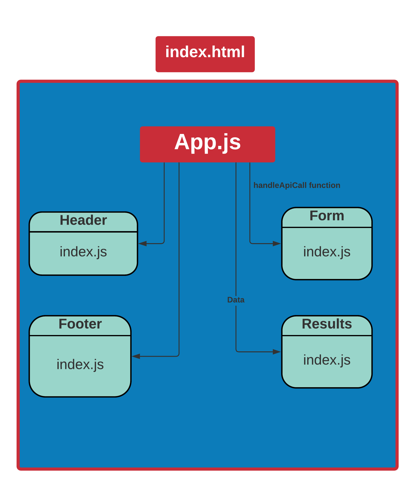

# RESTy

- A browser based API testing tool 🧰.
- API testing tool that can be run in any browser, allowing a user to easily interact with APIs in a familiar interface.

---

## UML

---

## Links

[SandBox](https://codesandbox.io/s/inspiring-lamport-3e0qh)

[Pull Request](https://github.com/Wesam-Alqawasmeh/RESTy/pull/1)
